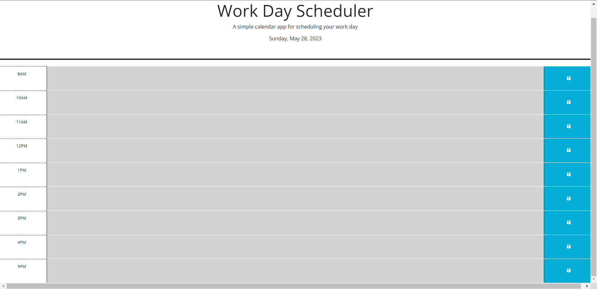

# scheduling-manager
this application will enable you to keep track of events

## how to use
click on the desired hour of your task and type the necessary info. once done click save. this will be saved to local storage so when you reload the page it will remain. each time block will be colored . gray means the hour has past, red means that is the current hour, green means that is a future hour

## where to find 

a screenshot of finished product below: 
 this screenshot was taken @ 11:30 PM so all timeblocks are showing as past.

link to github page: https://mckit77.github.io/scheduling-manager/

link to github repo: https://github.com/MCKIT77/scheduling-manager